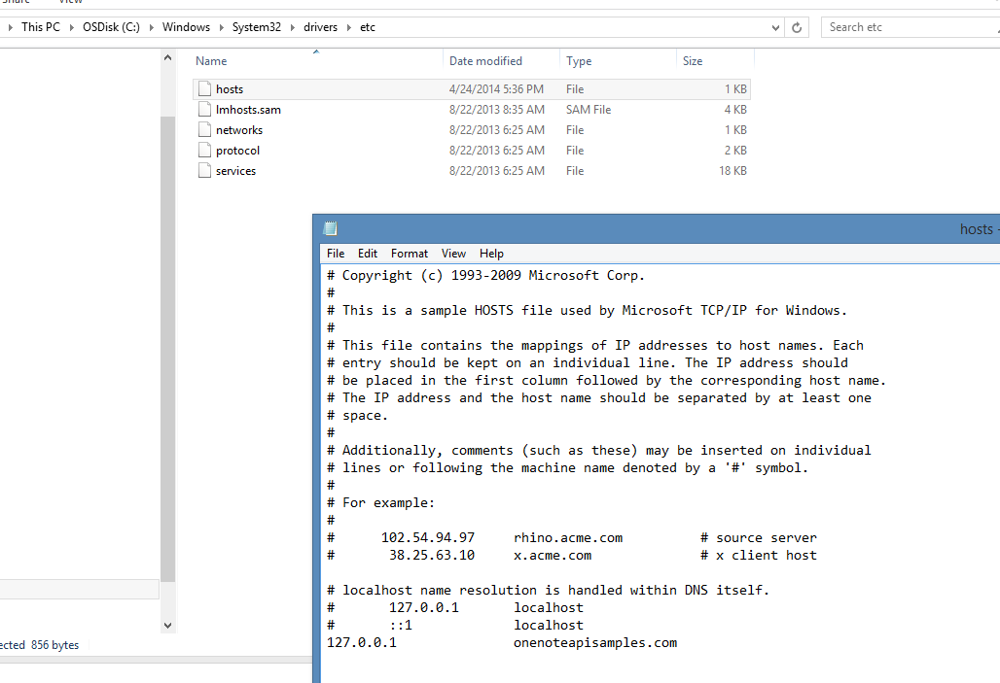

#OneNote API Ruby on Rails Sample README

Created by Microsoft Corporation, 2014. Provided As-is without warranty. Trademarks mentioned here are the property of their owners.
<<<<<<< HEAD
 
###API functionality demonstrated in this sample
This sample illustrates how to use the OneNote REST API for the following use cases:
    
* [Log-in the user](http://msdn.microsoft.com/EN-US/library/office/dn575435.aspx)
* [POST simple HTML to a new OneNote QuickNotes page](http://msdn.microsoft.com/EN-US/library/office/dn575428.aspx)
* [POST multi-part message with image data included in the request](http://msdn.microsoft.com/EN-US/library/office/dn575432.aspx)
* [POST page with a URL rendered as an image](http://msdn.microsoft.com/EN-US/library/office/dn575431.aspx)
* [POST page with HTML rendered as an image](http://msdn.microsoft.com/en-us/library/office/dn575432.aspx)
* [POST page with a PDF file rendered and attached](http://msdn.microsoft.com/EN-US/library/office/dn655137.aspx)
* [Extract the returned oneNoteClientURL and oneNoteWebURL links](http://msdn.microsoft.com/EN-US/library/office/dn575433.aspx)
 

###Prerequisites

=======
 
###API functionality demonstrated in this sample
This sample illustrates how to use the OneNote REST API for the following use cases:
    
* Authenticate the user in an Ruby on Rails app
* Create a OneNote page with simple HTML 
* Create a page with a URL rendered as an image on the page
* Create a OneNote page with multi-part message with image data included in the request
* Create a OneNote page with a PDF file attachment
 

###Prerequisites

>>>>>>> 90ca6b55847fe06f12b92e82721e9eaa583a04ca
#####Tools and Libraries

You will need to download, install, and configure for your Ruby on Rails development environment. If you are new to Ruby on Rails, please go to [http://rubyonrails.org/download](http://rubyonrails.org/download) to get started.

Once you have your Ruby on Rails environment up and running, be sure to verify the prerequisites for these too (in Gemfile for yours app).
    
   * gem 'jquery-rails'
   * gem 'rest-client'	
<<<<<<< HEAD
   * gem 'rest-client-multipart'
    

You also need a normal URL with hostname (not just an IP address) to use for the Redirect URL. If you run this from your own desktop, you'll need to modify your Hosts file (in C:\Windows\System32\drivers\etc for Windows machines and /private/etc for Macs) and map your local server IP address to a new domain name, as in the following example.
 

#####Microsoft Account
    
As the developer, you'll need to have a [Microsoft account](http://msdn.microsoft.com/EN-US/library/office/dn575426.aspx) and get a client ID so your app can authenticate with the Microsoft Live connect services.
    

###Using the sample###

After you've setup your development tools, and installed the prerequisites listed above,....

   1. Download the repo as a ZIP file to your local computer, and extract the files. Or, clone the repository into a local copy of Git.
   2. Go to the [Microsoft app registration page](https://account.live.com/developers/applications/index).
   3. On the API Settings page, set Mobile or desktop setting to No.
   4. Set the Redirect URI to the domain name of your web site, as in the following example.

   5. On the App Setting page, copy the client ID and secret into the config/onenote.yml file. 
   6. Build and run the Ruby on rails app. 
   7. Open a browser and navigate to the app running by default on port 3000. 
   8. Login using your Microsoft account, and allow the app to create pages in your OneNote notebooks. 

### Version info

This is the initial public release for this code sample.

  
### Learning more

* Visit the [dev.onenote.com](http://dev.onenote.com) Dev Center
* Contact us on [StackOverflow (tagged OneNote)](http://go.microsoft.com/fwlink/?LinkID=390182)
* Follow us on [Twitter @onenotedev](http://www.twitter.com/onenotedev)
* Read our [OneNote Developer blog](http://go.microsoft.com/fwlink/?LinkID=390183)
* Explore the API using the [apigee.com interactive console](http://go.microsoft.com/fwlink/?LinkID=392871).
Also, see the [short overview/tutorial](http://go.microsoft.com/fwlink/?LinkID=390179). 
* [API Reference](http://msdn.microsoft.com/en-us/library/office/dn575437.aspx) documentation
* [Debugging / Troubleshooting](http://msdn.microsoft.com/EN-US/library/office/dn575430.aspx)
* [Getting Started](http://go.microsoft.com/fwlink/?LinkID=331026) with the OneNote API
=======
   * gem 'rest-client-multipart'
    

#####Microsoft Account
    
As the developer, you'll need to have a [Microsoft account](http://msdn.microsoft.com/EN-US/library/office/dn575426.aspx) and get a client ID so your app can authenticate with the Microsoft Live connect services.
    

###Using the sample###

After you've setup your development tools, and installed the prerequisites listed above,....

   1. Download the repo as a ZIP file to your local computer, and extract the files. Or, clone the repository into a local copy of Git. 
   2. If you are testing on your own desktop, you can't use http://localhost as your domain, so edit your Hosts file (in C:\Windows\System32\drivers\etc for Windows machines and /private/etc for Macs) and map your local server IP address to a new domain name.
   3. Get a client ID string and copy it into the file: config/onenote.yml. Use the domain that you have mapped to your local server IP address for the root domain and the redirect URL.
   5. Build and run the Ruby on rails app.
   6. Authenticate in the running app, using your Microsoft account. 
   7. Allow the app to create new pages in OneNote. 
>>>>>>> 90ca6b55847fe06f12b92e82721e9eaa583a04ca
